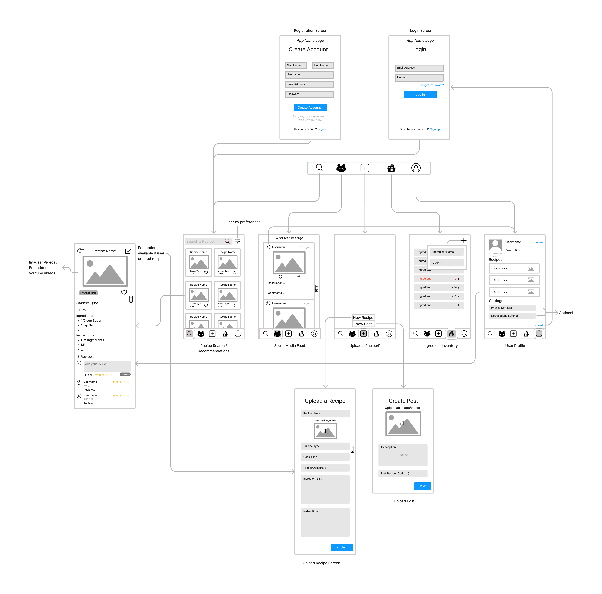

# RecipeQuest

## Table of Contents
1. [Overview](#overview)
1. [Product Spec](#product-spec)
1. [Wireframes](#wireframes)
2. [Schema](#schema)

## Overview
### Description
People are commonly faced with a difficult decision to decide what to cook. Particularly, new cooks don't have the experience or knowledge to cook a variety of dishes, and hence rely on repetitive or take-home food. RecipeQuest provides users with recipe recommendation based on user preferences on cuisine types, meal time, diet plans, and available ingredients. It also performs as a social media platform, where users can upload and share traditional/unique recipes and update the recipe database. 

### App Evaluation

- **Category:** Health & Fitness | Social
- **Mobile:** 
    - Uses camera to upload recipe images, scan barcodes
    - Mobile is more accessible for daily usage
- **Story:** Simplifies user's daily decision making process while providing an interactive social platform for users to share their ideas and challenges.
- **Market:** Anyone who wants to cook a meal, particularly new cooks (Ex: college students). User-oriented recipe database attracts cooks who wants to try out signature recipes.
- **Habit:** Users can use this app daily to diversify their meals. They can also share their daily meals among their followers. Potential leaderboard and challenges might also attract users to app. Push notifications can also remind users to utilize app.
- **Scope:** 
    - **Version 1** would allow users to filter recipes and upload their recipes to update database. Users can keep track of their ingredient inventory through manual ingredient input.
    - **Version 2** would integrate a social media platform where users can post their recipes or challenges they face while cooking.
    - **Version 3** would include more user interactions with recipe and posts.
    - **Version 4 (Stretch)** would include ability for users to scan barcode to add ingredient and scan an image to search for recipes.

## Product Spec

### 1. User Stories (Required and Optional)

**Required Must-have Stories**

_Version1_
* [x] User can search for recipes based on user preferences using [Spoonacular Nutrition API](https://rapidapi.com/spoonacular/api/recipe-food-nutrition)
* [x] User can view details about recipe
    * Ingredients, instructions, cook time, images, videos, tags
* [x] User can create a new account
* [x] User can login/logout 
* [x] User can view/update ingredients inventory
* [x] User can upload recipes (including photos/videos) and update recipe database
    * Initialize database with recipes extracted from a Recipe API (Ex: Spoonacular API), then update database with user-uploaded recipes
* [x] User can switch between Tabs (Recipe Search, Ingredients Inventory, Social Feed, Profile Page)
   
_Version2_
* [x] User can view/update user profiles
    * [x] Personal Information
    * [x] Recipes liked
    * [x] Recipes made
    * [x] Recipes uploaded
* [x] User can post recipes/questions/challenges in the social feed
* [x] User can like, share, and comment recipes/posts

**Optional Nice-to-have Stories**

_Version3_ (Stretch)
* [x] User can edit previously uploaded recipes
* [x] Initial search screen displays random/recommended recipes
* [x] User can share recipes directly to social feed
* [x] Implement JUnit testing for utilities
* [x] Add Databinding support for cleaner Activities and Fragments

_Version4_ (Stretch)
* [x] User can scan food barcode to update inventory
* [x] User can search for a recipe based on image
* [x] Explore Kotlin usage
* [x] Implement navigation drawer in Profile fragment
* [ ] User can view a demo of app before account creation

### 2. Screen Archetypes

* Register Screen
    * Users can create a new account
* Login Screen
    * Users can login
* Stream - Recipe Feed
    * Users can view recipe recommendations
* Search Screen - Recipe Search
    * Users can search for recipes based on user preferences
* Detail - Recipe Details
    * Users can view details about recipe
    * Users can add reviews to recipes
* Stream - Ingredient Inventory
    * Users can view ingredient inventory
* Creation - Update Ingredient inventory
    * Users can add/update inventory
* Creation - Upload Recipes
    * Users can upload recipes and update recipe database
* Stream - Social Media
    * Users can post recipes/questions/challenges in the social media platform
* Profile
    * Users can view user profiles
    * Users can view user-uploaded recipes/posts in user profile
    * Users can logout

### 3. Navigation

**Tab Navigation** (Tab to Screen)

* Recipe Recommendations Feed
* Social Media Platform
* Upload a Recipe / Post
* Ingredient Inventory
* User Profile

**Flow Navigation** (Screen to Screen)

* Register Screen --> Recipe Feed
* Login Screen --> Recipe Feed
* Stream: Recipe Feed 
    * --> Recipe Details
    * --> Recipe Search
* Stream: Social Media 
    * --> Recipe Details
    * --> User Profile
* Creation: Upload Post/Recipe
    * None
* Stream: Ingredient Inventory
    * --> Add ingredient/Scan Barcode
* Profile
    * --> Uploaded Recipe feed

## Wireframes

### [BONUS] Digital Wireframes & Mockups

### [BONUS] Interactive Prototype

## Schema 

### Models
User

| Property     |  Type        |  Description |
| --------     | --------     | --------     |
| objectId | String       | Unique id for user|
| firstName | String | User's first name |
| lastName     | String | User's last name |
| username    | String    | User's unique username |
| email    | String | User's email|
| profileImage | File | User's profile image |
| followerList | Array | List of user's followers |
| followingList | Array | List of users followed by current user | 
| ingredientList |  Array | List of user's ingredient inventory |
| recipesUploaded | Array | List of recipes uploaded by user |
| recipesMade | Array | List of recipes made by user |
| postLiked (optional) | Array | List of post objects liked by user |

Ingredient

| Property     |  Type        |  Description |
| -------- | -------- | -------- |
| objectId | String       | Unique id for ingredient    |
| name | String | Ingredient Name |
| count | int | Count of ingredient |

Recipe

| Property     |  Type        |  Description |
| -------- | -------- | -------- |
| objectId | String       | Unique id for recipe    |
| author | Object Pointer (User) | Author of recipe (or null if extracted from API) |
| title | String | Recipe Name |
| media | Array | Array of media files (images, videos, youtube links) |
| ingredientList | Array | Array of ingredients required for recipe |
| instructions | Array | Array of instructions required for recipe |
| cooktime | int | Minutes required to cook recipe |
| cuisineType | String | Type of cuisine most correlated with recipe |
| reviews | Array | List of reviews given to recipe |

Post

| Property     |  Type        |  Description |
| -------- | -------- | -------- |
| objectId | String       | Unique id for post      |
| author | Object Pointer (User) | Author of post | 
| image | File | Post image if exists | 
| description | String | Description of post |
| likedBy | Array | List of users who liked this post |
| comments | Array | List of comments on post |

Review

| Property     |  Type        |  Description |
| -------- | -------- | -------- |
| objectId | String       | Unique id for review      |
| author | Object Pointer (User) | Author of review | 
| description | String | Description of review |
| rating | int | Rating of recipe (out of 5) |
| recipe | Object Pointer (Recipe) | Recipe correlated with review | 

Comment

| Property     |  Type        |  Description |
| -------- | -------- | -------- |
| objectId | String       | Unique id for comment      |
| author | Object Pointer (User) | Author of comment | 
| description | String | Description of comment |
| post | Object Pointer (Post) | Post correlated with comment | 

### Networking
- Recipe Feed:
    - (Read/GET) Query of all recipes that matches user's preferences ordered by best match
- Recipe Details:
    - (Read/GET) Query of all information regarding particular recipe
- Social Media Feed:
    - (Read/GET) Query of posts posted by user's followers
    - (Create/POST) Create a new like on a post
    - (Delete) Delete existing like
    - (Create/POST) Create a new comment on a post
    - (Delete) Delete existing comment
- User Profile:
    - (Read/GET) Query of all recipes made by user
    - (Read/GET) Query of all recipes uploaded by user
    - (Update/PUT) Update user profile image
    - (Read/GET) Query logged in user object
- Create Post/Recipe:
    - (Creat/POST) Create a new recipe/post object
- Ingredient Inventory:
    - (Create/POST) Create a new ingredient object
    - (Update/PUT) Update ingredient count

#### Spoonacular Nutrition API
Base Url: https://spoonacular-recipe-food-nutrition-v1.p.rapidapi.com

HTTP Verb | Endpoint | Description |
----------|----------|------------
`GET`    | /recipes/complexSearch?query=*query* | Get recipes that match query
`GET` | /recipes/findByIngredients?ingredients=... | Get recipes by ingredient
`GET` | /recipes/*recipe_id*/information | Get details about recipe
`GET` | /recipes/random?tags=... | Get random recipes
`GET` | /food/ingredients/search?query=... | Search for ingredients in inventory
